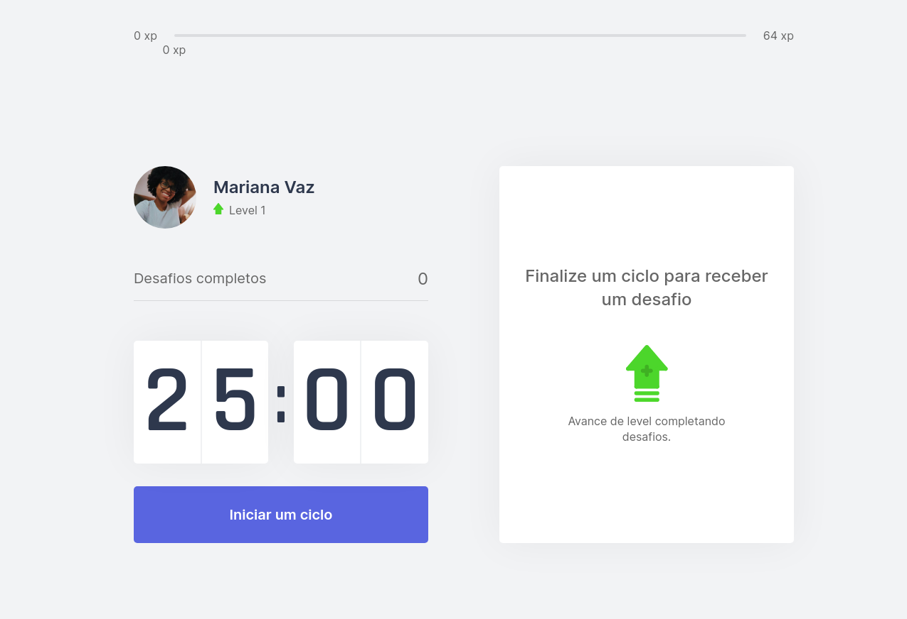

<p align="center">
  
</p>

<p align="center">
  
</p>

## Tecnologias

Esse projeto foi desenvolvido com as seguintes tecnologias

- [React](https://reactjs.org)
- [Next.js](https://nextjs.org/)
- [TypeScript](https://www.typescriptlang.org/)

## Prévia

Você pode ver a prévia desse projeto na Vercel. Just do it!

[](https://moveit-oimarianinha.vercel.app/)

## Instruções para uso

Clone o projeto e vá até a pasta

```bash
$ git clone https://github.com/oimarianinha/moveit && cd moveit
```

Siga os passos abaixo
```bash
# Instale as dependências
$ yarn

# Inicie o projeto
$ yarn dev
```
## Projeto

Esse projeto foi desenvolvido na Next Level Week #4 da [Rocketseat](https://rocketseat.com.br/) 

---
